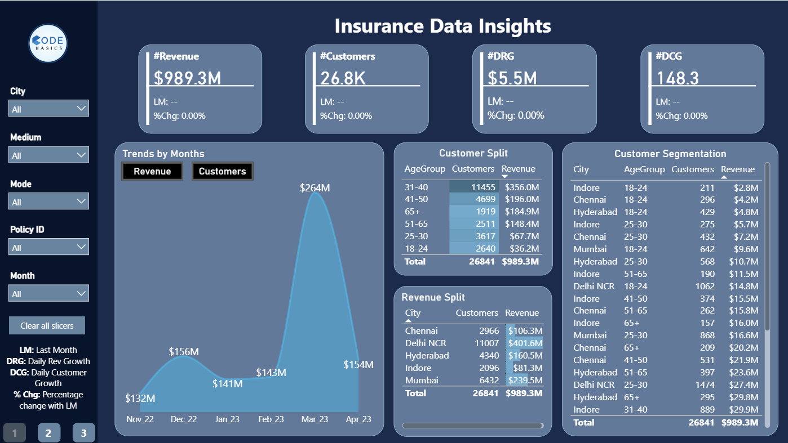
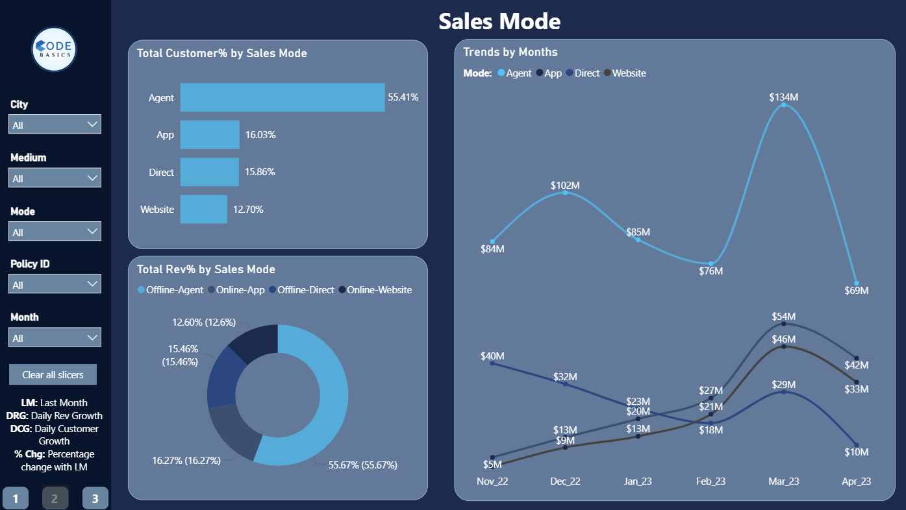
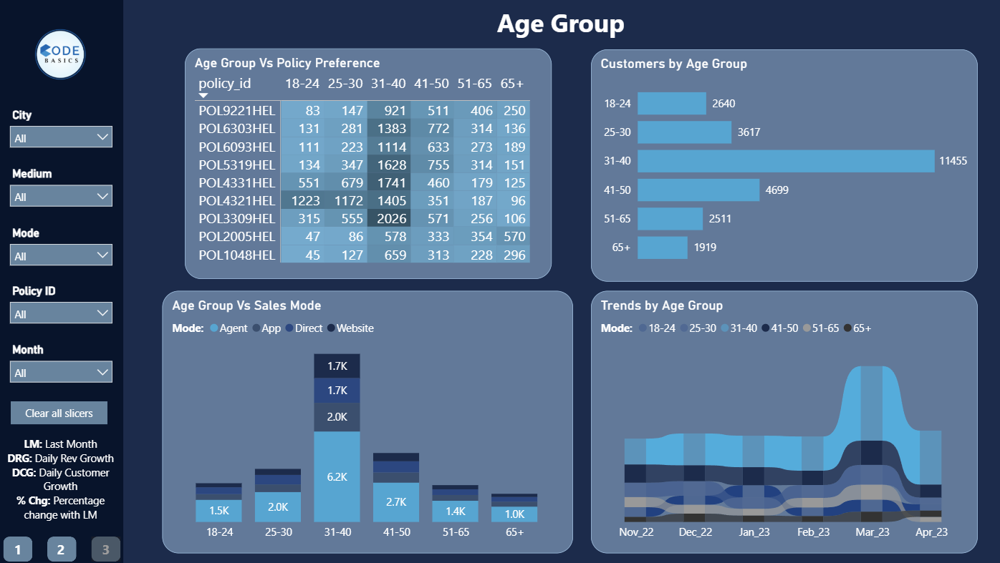

# Insurance Performance Analysis – Virtual Internship Project

**Insurance Performance Analysis** is a Power BI dashboard built as part of my **virtual internship** with **AtliQ Technologies** (Data Analyst role).  

The project analyzes insurance data for **Shield Insurance**, a fictional company, to provide insights into claims, premiums, policies, risk profiles, customer segments, and performance metrics. It helps identify trends, high-risk areas, profitable segments, and opportunities for better underwriting and customer retention.

This was a complete end-to-end internship deliverable — from data extraction and SQL querying to dashboard creation and business recommendations.

**Live Dashboard:** [Click Here](https://app.powerbi.com/view?r=eyJrIjoiNjExYTkxZWItYjM2MS00NmZkLTgyOTAtZDg2NjdlYzA0NDM5IiwidCI6ImM2ZTU0OWIzLTVmNDUtNDAzMi1hYWU5LWQ0MjQ0ZGM1YjJjNCJ9)

## Features

- **Overall KPI Snapshot** — High-level cards displaying key metrics such as total revenue, total customers, daily revenue growth (DRG), and daily customer growth (DCG), with last-month comparisons and percentage change indicators.
- **Monthly Trends Analysis** — Interactive area charts visualizing revenue and customer growth trends over time, with options to toggle between revenue and customer views.
- **Customer Segmentation by Age Group** — Breakdown of customers and revenue contribution across different age groups, highlighting preferences and distribution patterns.
- **Revenue & Customer Split by City** — Table and visuals comparing customer counts and revenue across various cities, including age-group sub-splits within each location.
- **Sales Mode Performance** — Pie and bar charts showing customer percentage and revenue percentage by sales mode (Agent, App, Direct, Website), plus monthly trend lines for mode-wise performance.
- **Age Group vs Policy Preference & Sales Mode** — Table/heatmap displaying policy ID distribution across age groups, combined with stacked bar visuals for sales mode preferences by age segment.

## Key Highlights

1. **Virtual Internship Deliverable**  
   Completed as part of AtliQ Technologies virtual internship — focused on real-world insurance data analysis and Power BI visualization.

2. **Tailored Insurance Dashboard**  
   Designed specifically to support Shield Insurance's underwriting, claims, and sales teams with actionable insights.

3. **Seamless Data Integration**  
   Pulled and unified data from MySQL database and Excel/CSV sources into a robust Power BI model.

4. **Advanced DAX Metrics**  
   Created custom calculations for key insurance KPIs like Claim Ratio, Loss Ratio, Premium Growth %, and customer lifetime value proxies.

5. **Business Recommendations**  
   Highlighted high-risk segments, profitable policy types, and retention opportunities to improve overall profitability and risk management.

## Data Sources

The dashboard draws from:
1. **Excel/CSV Files** — Policy details, claims transactions, customer demographics, and premium references.
2. **MySQL Database** — Core fact tables (claims, premiums, policies) and dimension tables (customers, products, dates, regions).

## Tech Stack Used

- Microsoft Power BI (Desktop & Service)
- DAX (Data Analysis Expressions) for insurance-specific metrics (Claim Ratio, Loss Ratio, etc.)
- Power Query (for data transformation and cleaning)
- MySQL Database
- Excel / CSV handling
- Insurance domain knowledge (premiums, claims ratio, risk scoring, policy types)

## Screenshots

### Insurance Data Insights

### Sales Mode Analysis

### Age Group Analysis

## Links 🔗

&nbsp;&nbsp;

Cheers! 🚀
